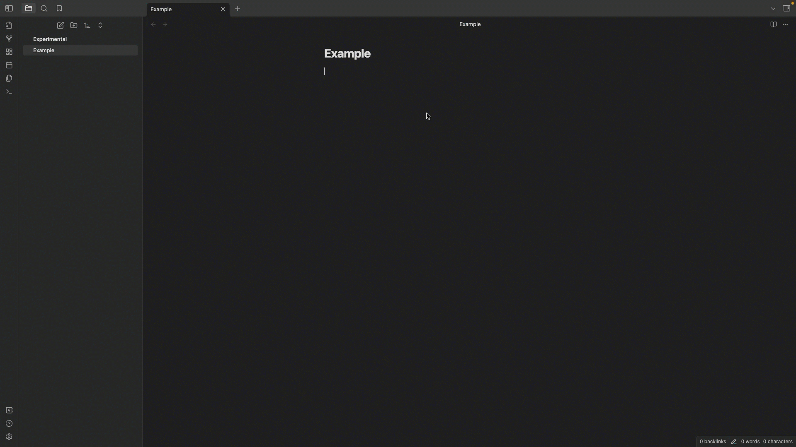
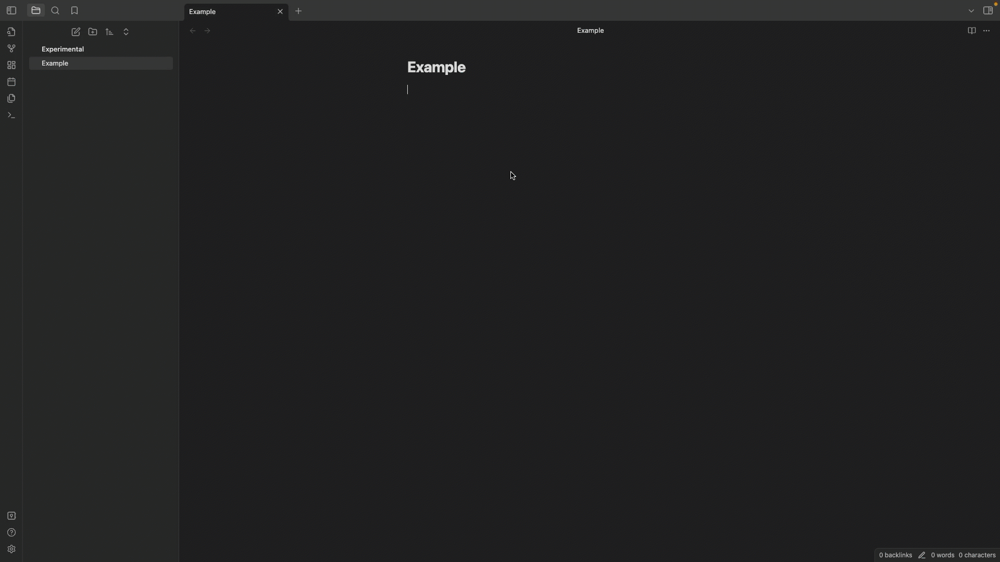
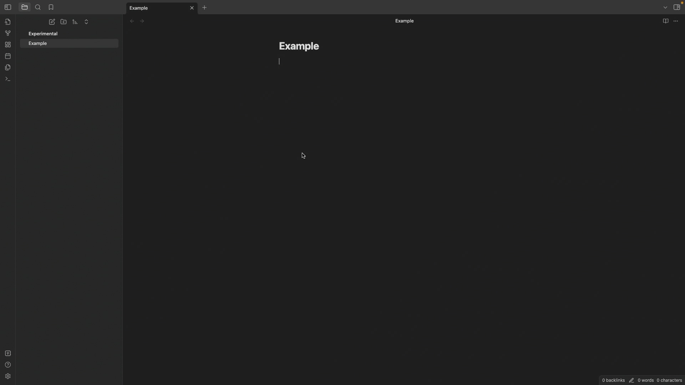

[](https://github.com/dario-baumberger/obsidian-json-table/actions/workflows/build.yml)
[](obsidian://show-plugin?id=deepl)

[](https://github.com/dario-baumberger/obsidian-json-table/blob/master/LICENCE)

# Obsidian JSON table

Simply switch between JSON and tables.

Generate a table from a JSON string or a URL (which returns JSON) or in your notes. Generate JSON from a table in your notes.

## Commands

| Command                               | Description                                                                                        |
| ------------------------------------- | -------------------------------------------------------------------------------------------------- |
| Generate table from selected JSON     | Creates a Markdown table based on your selected JSON. The JSON needs to be valid.                  |
| Generate table from selected JSON URL | Creates a Markdown table based on JSON data from selected URL. The URL needs to return valid JSON. |
| Generate JSON from a selected table   | Creatse JSON based on your selected table.                                                         |

### Examples

#### Table

```
| Name | Age | City   |
| ---- | --- | ------ |
| Doe  | 22  | Berlin |
| Pan  | 34  | Mumbai |
```



#### JSON

```
[{"Name":"Doe","Age":"22","City":"Berlin"},{"Name":"Pan","Age":"34","City":"Mumbai"}]
```



#### URL

-   `https://raw.githubusercontent.com/dario-baumberger/obsidian-json-table/master/demo/example.json`
-   `https://jsonplaceholder.typicode.com/todos`



## Installation

### Community Plugin

The Plugin was not release yet. You need to install it manually.

### Manually installing the plugin

-   Go to the latest [Releases](https://github.com/dario-baumberger/obsidian-json-table/releases)
-   Download `main.js`, `manifest.json`
-   save into your vault `VaultFolder/.obsidian/plugins/obsidian-json-to-table/`

## Contribution

-   Feel free to open an issue if you miss something
-   Feel free to open a Pull request to implement a feature
    -   Please extend tests if you ad logic
